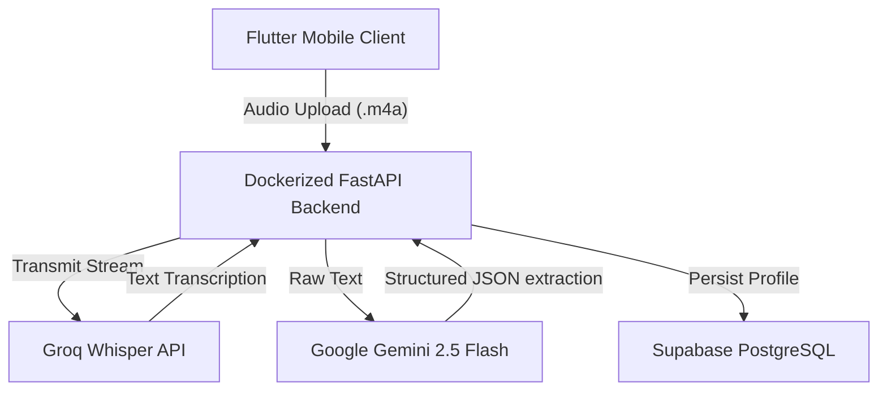

# VoiceFlow AI 🎙️

[](https://shubhampandey45-voiceflowai.hf.space/docs)
[](#-frontend-architecture)
[](#-database-schema)
[](https://shubhampandey45-voiceflowai.hf.space/docs)

A state-of-the-art, voice-first candidate screening and productivity platform. VoiceFlow AI captures audio spoken by recruiters or recruiters' voice notes, processes the audio stream to text, extracts structured JSON profiles using Generative AI, and persists them into a PostgreSQL database in real-time.

---

## 🚀 Live Demo & API Documentation

The backend service is containerized using Docker and deployed live in a production environment:

* 📄 **Swagger Interactive API Docs**: [https://shubhampandey45-voiceflowai.hf.space/docs](https://shubhampandey45-voiceflowai.hf.space/docs)
* ⚙️ **System Health Status**: [https://shubhampandey45-voiceflowai.hf.space/health](https://shubhampandey45-voiceflowai.hf.space/health)

---

## 🛠️ Tech Stack & Architecture

VoiceFlow AI is architected as a clean monorepo separating a high-performance RESTful API and a cross-platform mobile application.



### 🔹 Backend Tier (Python / FastAPI)
* **API Framework**: **FastAPI** utilizing a modular **Router-Service-Repository** pattern.
* **Database Layer**: **SQLAlchemy ORM** coupled with a local **SQLite** developer fallback and **Supabase (PostgreSQL)** for production.
* **Speech-to-Text**: **Groq API** running `whisper-large-v3` for sub-second, highly accurate audio transcribing.
* **LLM JSON Parsing**: **Google GenAI SDK** invoking `gemini-2.5-flash` with strict Pydantic structures for schema extraction.
* **Deployment**: Containerized using **Docker** running multi-worker Uvicorn configurations, deployed to **Hugging Face Spaces**.

### 🔹 Frontend Tier (Flutter / Dart)
* **Framework**: **Flutter** (compiles natively to iOS, Android, and Web).
* **Architecture**: Features a clean **layered architecture** (`data/`, `providers/`, `presentation/`).
* **State Management**: Implemented using a decoupled `ChangeNotifier` state-updating block.
* **Hardware Integrations**: Asynchronous local audio recording to dynamic `.m4a` files with reactive pulsing UI animations.

---

## 🗃️ Database Schema
The database runs on **PostgreSQL (Supabase)** and implements the following relations:

```sql
CREATE TABLE candidate_profiles (
    id SERIAL PRIMARY KEY,
    candidate_name VARCHAR(255) NOT NULL,
    experience_years INTEGER NOT NULL DEFAULT 0,
    skills TEXT[] NOT NULL,
    priority_score VARCHAR(50) NOT NULL DEFAULT 'Medium',
    raw_transcript TEXT NOT NULL,
    created_at TIMESTAMP WITH TIME ZONE DEFAULT CURRENT_TIMESTAMP
);

-- Production indexes optimizing speed for visual dashboard queries
CREATE INDEX idx_candidate_profiles_created_at ON candidate_profiles (created_at DESC);
CREATE INDEX idx_candidate_profiles_name ON candidate_profiles (candidate_name);
```

---

## 💼 How this Meets the Job Requirements

This project showcases production-level engineering capabilities across a broad full-stack environment:

1. **Full-Stack Ownership**: Built from absolute scratch including database seeding scripts, local environment settings, clean API routers, state notifications, custom Flutter widgets, Dockerfile builds, and cloud deployment pipelines.
2. **SQL Mastery & Database Design**: Employs SQLAlchemy ORM to manage dynamic migrations. Implemented custom schema types to natively handle PostgreSQL text arrays (`TEXT[]`) on production clouds while converting to serial JSON strings on SQLite locally for testing. Optimizes data lookups with targeted compound database index configurations.
3. **API Orchestration**: Combines multi-stage, high-throughput external API requests. Coordinates rapid pipeline transfers of binary audio data streams from the client device through Groq Whisper translation, Gemini metadata extraction, and Postgres storage.
4. **Cross-Platform Mobile Delivery**: Utilizes Flutter dependency overriding patterns to ensure seamless hardware interface integration (Microphone recording stream codecs) while preserving clean, Material 3 Dark theme aesthetics.
